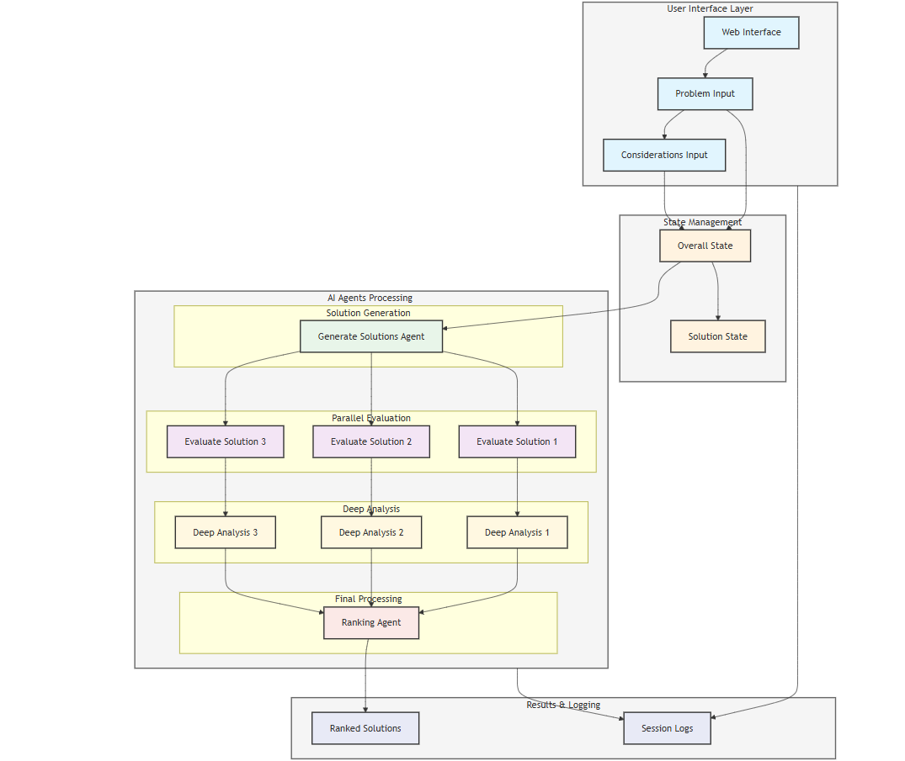

# How To Build AI Agents To Decompose Tasks &amp; Execute Parallel via Map Reduce

TL;DR

Built an AI-powered content moderation system that uses multiple specialized AI agents to check, validate, and improve content quality. The system uses document retrieval, web search, and three different grading agents to ensure content accuracy and relevance. While built for content moderation, this approach demonstrates how AI agents can work together to solve complex business problems reliably.

## Introduction

Picture this: You’re scrolling through social media, and every post you see is relevant, accurate, and high-quality. No spam, no fake news, no misleading content. Sounds impossible? That’s exactly the challenge I tackled by building an AI-powered content moderation system. Through my journey of creating this system, I discovered that the real power lies not in using a single AI, but in making multiple AI agents work together, each handling a specific part of the quality control process.

Full Article : [https://medium.com/@learn-simplified/How-To-Build-AI-Agents-To-Decompose-Tasks-Execute-Parallel-via-Map-Reduce-b1c3c4c3b9df


## What's This Project About

This article takes you through my process of building a multi-agent AI system for content moderation. The system works like a team of specialized workers — one agent checks if content matches our knowledge base, another verifies factual accuracy, and a third ensures the content actually answers user questions. These agents work together using a mix of local document search and web searches to find information.

The system follows a clear workflow:

When content arrives, it first goes through document retrieval to find relevant information
A grading agent checks if the retrieved information is actually relevant
If local information isn’t sufficient, the system automatically searches the web
Another agent verifies that no false information (hallucinations) is being added
A final agent ensures the content actually addresses what was asked
While this might sound complex, I’ve broken down each part into manageable pieces and explained how they work together. You’ll see actual code examples, understand why each component is necessary, and learn how to build similar systems for your own needs.

## Why Work on It?

In today’s business landscape, content moderation isn’t just about filtering out bad content — it’s about ensuring quality at scale. Whether you’re running a social media platform, managing a content website, or handling customer support, the challenge of maintaining content quality while keeping up with volume is universal.

Through this article, I show how even a fictional company can implement sophisticated AI solutions to:

Automate quality control while maintaining high standards
Scale content moderation without sacrificing accuracy
Reduce the workload on human moderators
Ensure consistent application of content guidelines
Handle complex moderation decisions with multiple validation steps
The system I’ve built demonstrates practical ways to use current AI technology to solve real business problems. While the example is about content moderation, the same multi-agent approach can be adapted for other business processes that require multiple validation steps.

## Architecture



# Tutorial: Lets Built Marketing Campaign Analyzer Using AI Agents

## Prerequisites
- Python installed on your system.
- A basic understanding of virtual environments and command-line tools.

## Steps

1. **Virtual Environment Setup:**
   - Create a dedicated virtual environment for our project:
   
     ```bash
     python -m venv How-To-Build-AI-Agents-To-Decompose-Tasks-Execute-Parallel-via-Map-Reduce
     ```
   - Activate the environment:
   
     - Windows:
       ```bash
       How-To-Build-AI-Agents-To-Decompose-Tasks-Execute-Parallel-via-Map-Reduce\Scripts\activate       
       ```
     - Unix/macOS:
       ```bash
       source How-To-Build-AI-Agents-To-Decompose-Tasks-Execute-Parallel-via-Map-Reduce/bin/activate
       ```
   
# Installation and Setup Guide

**Install Project Dependencies:**

Follow these steps to set up and run the  Built Social Media Content Moderation Quality Control Using AI Agents

1. Navigate to your project directory:
   ```
   cd path/to/your/project
   ```
   This ensures you're in the correct location for the subsequent steps.

2. Install the required dependencies:
   ```
   pip install -r requirements.txt   
   ```
   This command installs all the necessary Python packages listed in the requirements.txt file.


## Run - Hands-On Guide: Built Social Media Content Moderation Quality Control Using AI Agents

   ```bash 
     
      # Run 
      streamlit run main.py
      
   ```

## Conclusion and Next Steps

Congratulations! You've just Built Social Media Content Moderation Quality Control Using AI Agents